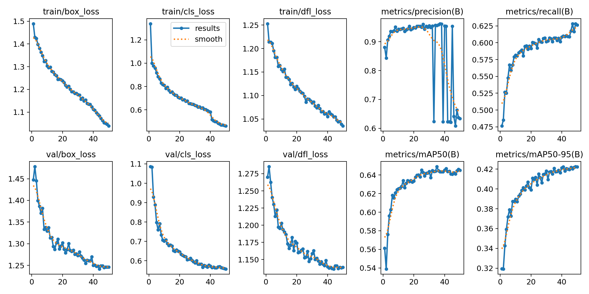
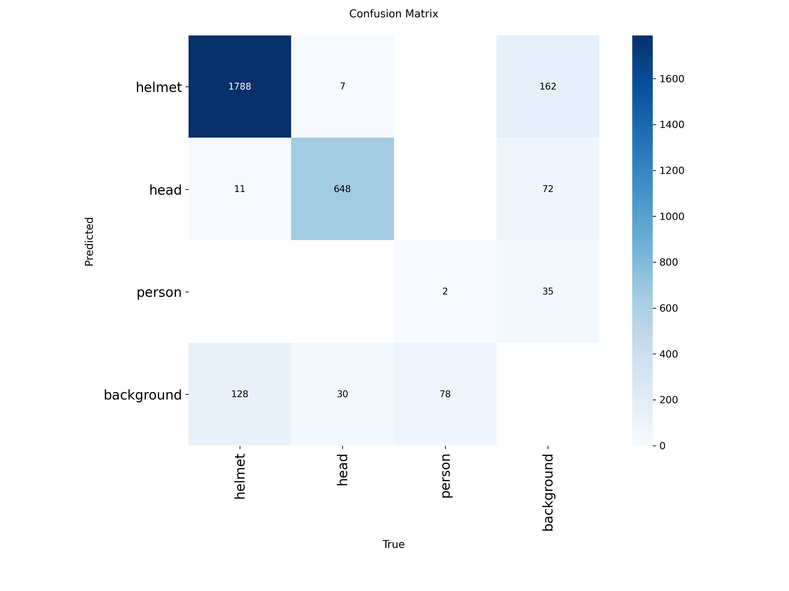
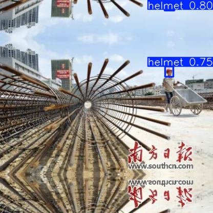
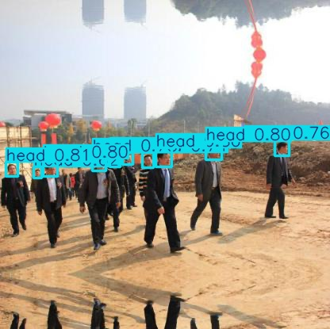
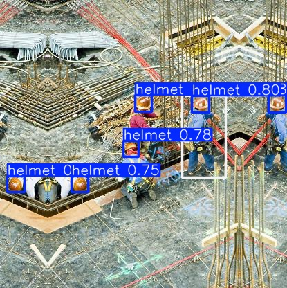
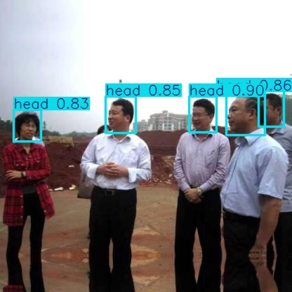

# 🦺 Hard Hat Detection with YOLOv8

An object detection model that identifies whether workers are wearing safety helmets —
a real-world safety-inspection use case for industrial environments.

The model detects three classes:

| id | class | meaning |
|----|--------|---------|
| 0 | `helmet` | worker wearing a hard hat ✅ |
| 1 | `head` | head without a hard hat ⚠️ |
| 2 | `person` | a person |

---

## 📦 Dataset

[Hard Hat Detection Dataset – Kaggle](https://www.kaggle.com/datasets/andrewmvd/hard-hat-detection)

- 5,000 images annotated with bounding boxes
- Original format: **Pascal VOC** (one `.xml` per image)
- Converted to **YOLO** format for training

Class distribution (bounding boxes): `helmet` ≈ 18,966 · `head` ≈ 5,785 · `person` ≈ 751.

---

## 🛠️ Data Preparation

The annotations were converted from Pascal VOC (corner pixels in absolute coordinates)
to YOLO format (normalized center coordinates), then split into
**80% train / 10% val / 10% test** (4000 / 500 / 500 images).

**Conversion formulas**

```
x_center = ((xmin + xmax) / 2) / image_width
y_center = ((ymin + ymax) / 2) / image_height
width    = (xmax - xmin) / image_width
height   = (ymax - ymin) / image_height
```

**Folder structure after conversion**

```
dataset/
├── images/
│   ├── train/   ├── val/   └── test/
└── labels/
    ├── train/   ├── val/   └── test/
```

**`data.yaml`**

```yaml
path: dataset
train: images/train
val: images/val
test: images/test

nc: 3
names: ['helmet', 'head', 'person']
```

The full conversion and split code is in [`hardhat_detection.ipynb`](hardhat_detection.ipynb).

---

## 🚀 Training

Pretrained **YOLOv8s** was fine-tuned (transfer learning). Training ran on a
Google Colab **T4 GPU** and completed **50 epochs in ~1.3 hours**.

**Command**

```bash
yolo detect train data=data.yaml model=yolov8s.pt epochs=50 imgsz=640 batch=16
```

| Setting | Value |
|---------|-------|
| Base model | `yolov8s.pt` |
| Epochs | 50 |
| Image size | 640 |
| Batch | 16 |
| Hardware | Tesla T4 GPU (Colab) |

---

## 📊 Results

Evaluated on the held-out **test set** (500 unseen images):

| Class | Precision | Recall | mAP50 | mAP50-95 |
|-------|-----------|--------|-------|----------|
| **helmet** | 0.965 | 0.905 | **0.959** | 0.646 |
| **head** | 0.930 | 0.878 | **0.929** | 0.619 |
| person | 0.000 | 0.000 | 0.010 | 0.004 |
| **all** | 0.632 | 0.595 | 0.632 | 0.423 |

**Reading the results:** the two classes that matter for the safety task —
`helmet` and `head` — are detected very accurately (mAP50 of **0.96** and **0.93**).
The `person` class scores near zero because it is extremely rare in the dataset
(~751 boxes vs. ~19k for `helmet`), so the model had too few examples to learn it.
This pulls the overall `all` average down, but does not affect the core goal of
distinguishing helmet-wearing vs. bare-headed workers. Test-set scores closely match
the validation scores, indicating the model generalizes well rather than memorizing.

**Training curves**



**Confusion matrix**



**Sample predictions**






---

## ▶️ How to Run

1. Open `hardhat_detection.ipynb` in Google Colab (enable GPU: *Runtime → Change runtime type → T4 GPU*).
2. Run the cells top to bottom (the notebook downloads the dataset, converts it, trains, and evaluates).
3. Trained weights are saved at `runs/detect/hardhat_v1/weights/best.pt`.

**Inference on a new image**

```python
from ultralytics import YOLO
model = YOLO("best.pt")
model.predict(source="path/to/image.png", save=True, conf=0.4)
```

**Webcam / video (run locally)**

```python
model.predict(source=0, show=True)              # webcam
model.predict(source="video.mp4", save=True)    # video file
```

---

## 🧰 Tech Stack

- [Ultralytics YOLOv8](https://docs.ultralytics.com/)
- Python, OpenCV, Matplotlib

---

## 📁 Repository Structure

```
.
├── hardhat_detection.ipynb   # full pipeline: prep -> train -> eval -> predict
├── data.yaml                 # dataset config
├── best.pt                   # trained model weights
├── assets/                   # result and prediction images
└── README.md
```

---

## 📝 Learning Outcomes

- Understand the object-detection workflow with YOLO
- Convert a Pascal VOC bounding-box dataset to YOLO format
- Train, evaluate, and visualize a detection model
- Apply AI to a real-world safety-automation problem
